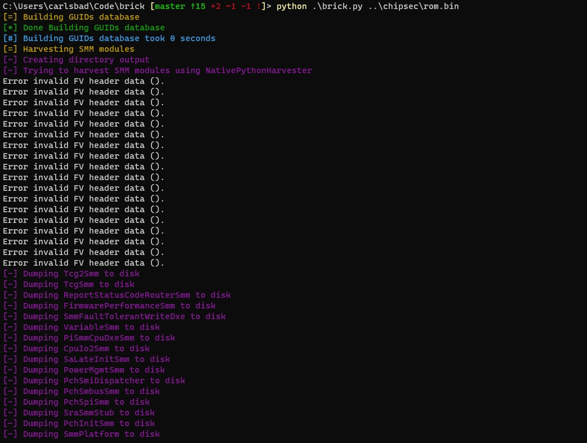
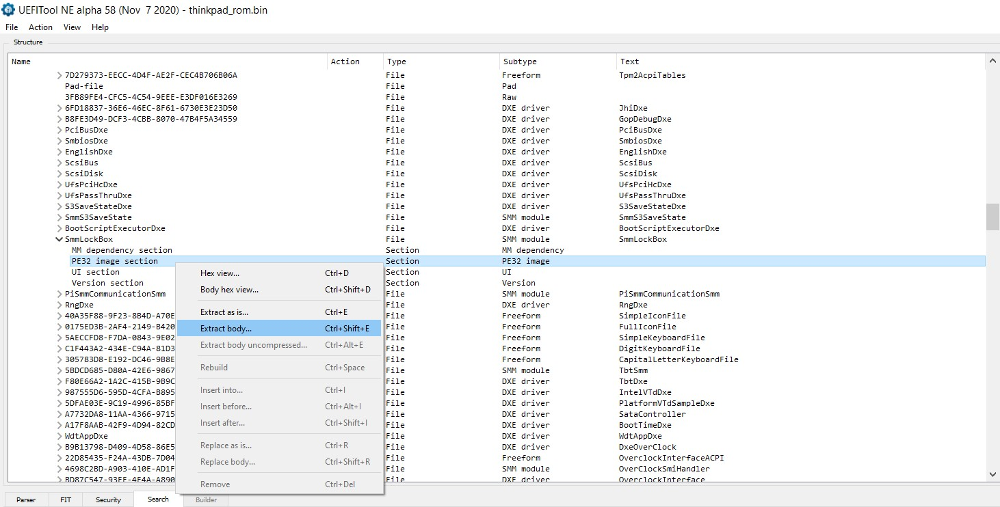
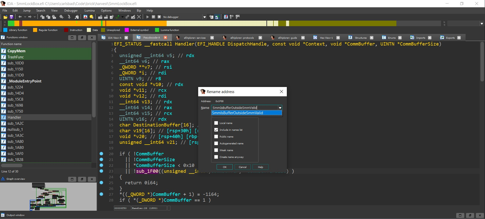
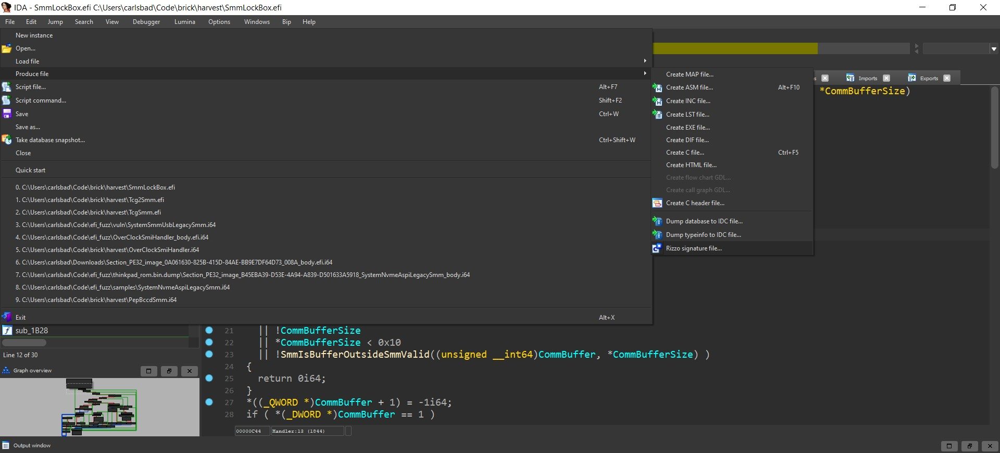
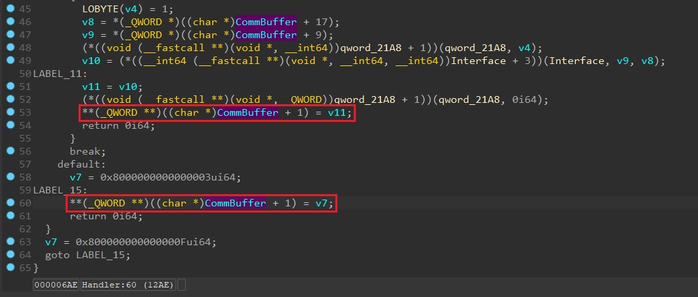
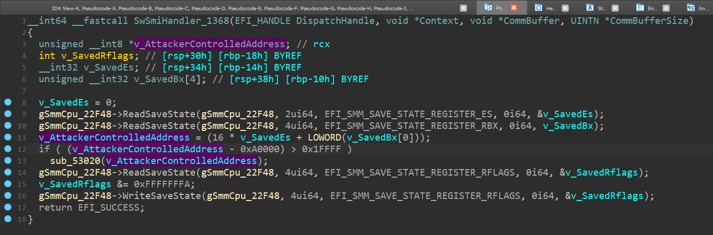
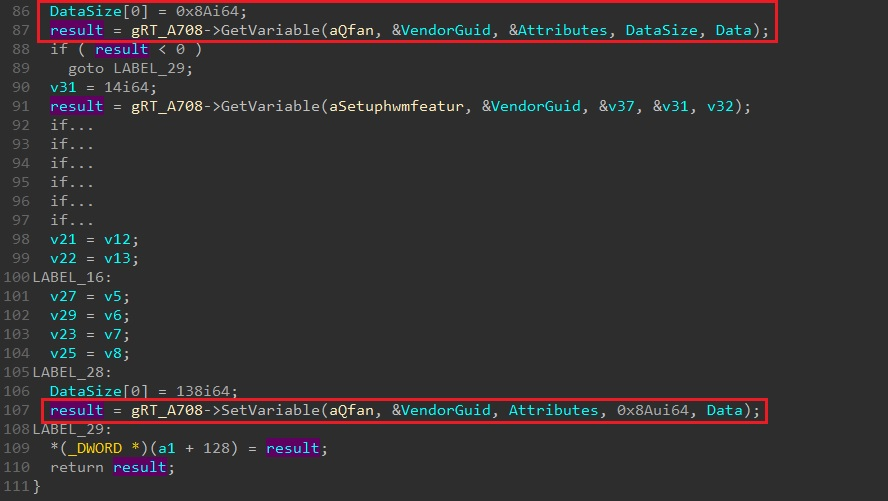

# brick

brick is a small tool designed to identify potentially vulnerable SMM modules in a UEFI firmware image. It is comprised out of a collection of modules (implemented as IDAPython scripts), each responsible for identifying a specific vulnerability/anti-pattern in SMM code.

## Pre-requisites
* IDA Pro version 7.5 or above. Older IDA versions might work as well but were not tested.
* The latest version of [efiXplorer](https://github.com/binarly-io/efiXplorer).
* Python 3.9 or above.

## Installation
* Clone this repository:  
`git clone --recursive https://github.com/Sentinel-One/brick.git`
* Install necessary requirements:  
`pip install -r requirements.txt`
* Install [Bip](https://github.com/synacktiv/bip)
* Install [Rizzo](https://github.com/tacnetsol/ida/tree/master/plugins/rizzo)

## Usage
* Obtain a dump of the firmware image you wish to scan.

* Run: `python brick.py <uefi_rom> [-o outdir]` and wait for the analysis to complete (can take up to 15-20 minutes, depending on how many SMM modules are found in the UEFI firmware image).
  

* Open the `{rom}.brick` output file and browse the results. Usually, further manual investigation is required to classify results as either true positives or false positives. See [Interpreting results](#interpreting-results) for more details.

### Optional: help brick locate SmmIsBufferOutsideSmmValid()
To help brick locate calls to `SmmIsBufferOutsideSmmValid()` more accurately you can do the following:
* Open the UEFI firmware image using [`UEFITool`](https://github.com/LongSoft/UEFITool).
* Locate and extract the PE32 section of `SmmLockBox.efi`, since we know it calls `SmmIsBufferOutsideSmmValid()` multiple times.

* Open the module in IDA, analyze it with `efiXplorer` (CTRL-ALT-e) and navigate to the `Handler` function. Identify the call to `SmmIsBufferOutsideSmmValid` and rename the function accordingly.

* Produce a Rizzo signature file:

* Copy the new signature file to the `brick/modules/buffer_outside_smm/sig` directory. Make sure to give it a `.riz` extension.
* Run again the procedure listed under [Usage](#usage).

## Interpreting results

By default, `brick` writes all results to an output file named `{rom}.brick`. The resulting output file can be further divided into 3 categories:

* **Might be true positives**: This section is comprised out of SMM executables for which at least one module raised a warning. Careful manual examination is required to further classify the results as either true positives or false positives.
* **Likely to be false positives**: This section is also comprised out of SMM executable for which at least one module raised a warning. However, all the executables in this section are believed to originate from a reference implementation such as [EDK2](https://github.com/tianocore/edk2) and therefore most chances are this is just a false positive.
* **No vulnerabilities found**: This section is comprised out of SMM executables for which no module raised a warning. Additional manual examination is required before these executables can be dismissed as bug free.

## Modules
Currently, brick uses the following heuristics to locate potentially vulnerable SMM modules:
#### SMI handlers not calling [SmmIsBufferOutsideSmmValid()](https://github.com/tianocore/edk2/blob/master/MdePkg/Library/SmmMemLib/SmmMemLib.c):  
SMI handlers are expected to call [SmmIsBufferOutsideSmmValid()](https://github.com/tianocore/edk2/blob/master/MdePkg/Library/SmmMemLib/SmmMemLib.c) to make sure user-supplied arguments do not overlap with SMRAM.
Failure to do so might lead to what is commonly known as a [confused-deputy attack](https://en.wikipedia.org/wiki/Confused_deputy_problem) in which the highly privileged SMI handler is tricked by lower privileged code to overwrite or leak out SMRAM contents. By leveraging the function-signature matching capabilities of [`Rizzo`](https://github.com/tacnetsol/ida/blob/master/plugins/rizzo/rizzo.py), we can pinpoint SMI handlers that don't call `SmmIsBufferOutsideSmmValid()` at all, which put them at risk of being abused by attackers.

#### Usage of CSEG-related magic numbers:
Some SMI handlers only check caller-provided pointers against the address range of the *Compatibility SMRAM segment* (0xA0000-0xBFFFF). Since other SMRAM regions that might be active are not protected by these SMI handlers, `brick` currently flags them as potentially vulnerable.

#### Usage of legacy protocols
Some UEFI protocols are considered legacy as they were replaced by newer protocols. For example, `EFI_SMM_SW_DISPATCH_PROTOCOL` is deprecated in favor of `EFI_SMM_SW_DISPATCH2_PROTOCOL`. By itself, using a UEFI legacy protocol is by no means a vulnerability. Still, any SMM module making use of these legacy protocols probably originates from an older codebase and as such is more likely to be prone to various bugs.

#### Leaking out SMRAM contents via NVRAM variables
A common anti-pattern in firmware code is as follows:

Basically, the code uses the `GetVariable` service to retrieve the contents and size of some NVRAM variable. It then processes it in memory and finally writes it back by calling the  `SetVariable` service. The problem with the piece of code above is that the call to `SetVariable` is made using a *hardcoded size* rather than the actual size that was retrieved by `GetVariable`. If an attacker is able to set this NVRAM variable from the OS, he/she can make it much shorter than anticipated. As a consequence, the call to `GetVariable` will leave a large portion of the Data buffer uninitialized. These uninitialized bytes will be manifested eventually to NVRAM while processing the call to `SetVariable`, where they can be queried by attackers running only with OS-level privileges.

#### efiXplorer
In addition to being the main analysis engine upon which `brick` is built, `efiXplorer` also comes with its own set of heuristics that can detect a bunch of vulnerabilities such as SMM call-outs, buffer overflows, etc. During its operation, `brick` simply propagates these finding so that they'll show up in the resulting output file as well.

## Contribution
Since `brick` is a young project, bugs and missing features are likely to appear. Issues and pull requests are highly welcome.
