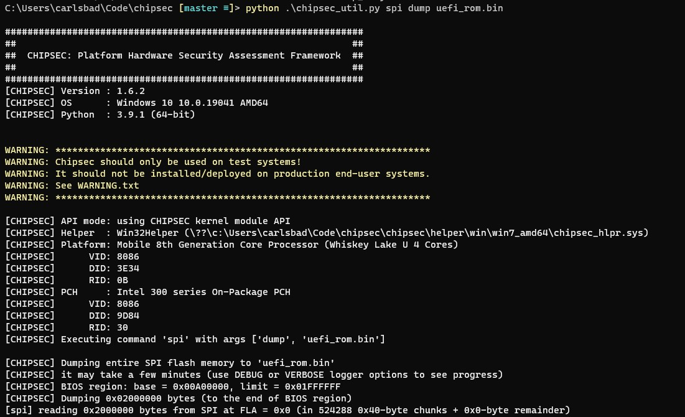

# Brick

Brick is a static vulnerability scanner used to pinpoint potentially vulnerable SMM modules within a UEFI firmware image. It is comprised out of a collection of modules (implemented as IDAPython scripts), each responsible for identifying a specific vulnerability/anti-pattern in SMM code.

## Pre-requisites
* IDA Pro version 7.7 or above. Older IDA versions might work as well but were not tested.
* Python 3.10 or above.

## Installation
* Clone this repository:  
`git clone --recursive https://github.com/Sentinel-One/brick.git`
* Install necessary Python packages:
`pip install -r requirements.txt`
* Install the [Bip](https://github.com/synacktiv/bip) framework and other required IDA plugins:
`python install.py`

## Usage
* Obtain a dump of the firmware image you wish to scan.

* Run: `python brick.py <uefi_rom> [-o outdir]` and wait for the analysis to complete (can take up to an hour, depending on how many SMM modules are found in the UEFI firmware image).
  

* Open the HTML report and browse the results. Usually, further manual investigation is required to classify results as either true positives or false positives.

## Detection Modules

### efiXplorer
In addition to being the main analysis engine upon which `Brick` is built, `efiXplorer` also comes with its own set of heuristics that can detect a bunch of vulnerabilities such as SMM call-outs, buffer overflows, etc. During its operation, `Brick` propagates these finding so that they'll show up in the resulting output file as well.

### Unsanitized nested pointers:
If the `CommBuffer` for the handler contains nested pointers, they must be sanitized by functions such as [SmmIsBufferOutsideSmmValid](https://github.com/tianocore/edk2/blob/master/MdePkg/Library/SmmMemLib/SmmMemLib.c) to make sure user-controllable arguments do not overlap with SMRAM.
Failure to do so might lead to what is commonly known as a [confused-deputy attack](https://en.wikipedia.org/wiki/Confused_deputy_problem) in which the highly privileged SMI handler is tricked by lower privileged code to overwrite or leak out SMRAM contents.

### Low SMRAM corruption
Some SMI handler write to the `CommBuffer` without first validating its size. Attackers can exploit this by placing the `CommBuffer` in a memory location just below SMRAM. When the handler will try to write to the `CommBuffer`, it will uninteionally corrupt the low portion of SMRAM.

### TOCTOU attacks
The `CommBuffer` itself lives outside of SMRAM, and so DMA attacks can change its contents while an SMI handler is executing. Because of that, double-fetches from the `CommBuffer` are dangerious because they do not necessarily yield the same values.

### CSEG-only aware handlers
Some SMI handlers only check caller-provided pointers against the address range of the *Compatibility SMRAM segment* (0xA0000-0xBFFFF). Since other SMRAM regions that might be active are not protected by these SMI handlers, `Brick` flags them as potentially vulnerable.

### Leaking out SMRAM contents via NVRAM variables
A common anti-pattern in firmware code is as follows:

Basically, the code uses the `GetVariable` service to retrieve the contents and size of some NVRAM variable. It then processes it in memory and finally writes it back by calling the  `SetVariable` service. The problem with the piece of code above is that the call to `SetVariable` is made using a *hardcoded size* rather than the actual size that was retrieved by `GetVariable`. If an attacker is able to set this NVRAM variable from the OS, he/she can make it much shorter than anticipated. As a consequence, the call to `GetVariable` will leave a large portion of the Data buffer uninitialized. These uninitialized bytes will be manifested eventually to NVRAM while processing the call to `SetVariable`, where they can be queried by attackers running only with OS-level privileges.

## Contribution
Since `Brick` is a young project, bugs and missing features are likely to appear. Issues and pull requests are highly welcome.

For additional information and other inquiries, feel free to contact the author directly:

Twitter: [@assaf_carlsbad](https://twitter.com/assaf_carlsbad)  
E-Mail: [carlsbad@sentinelone.com](mailto://carlsbad@sentinelone.com)
